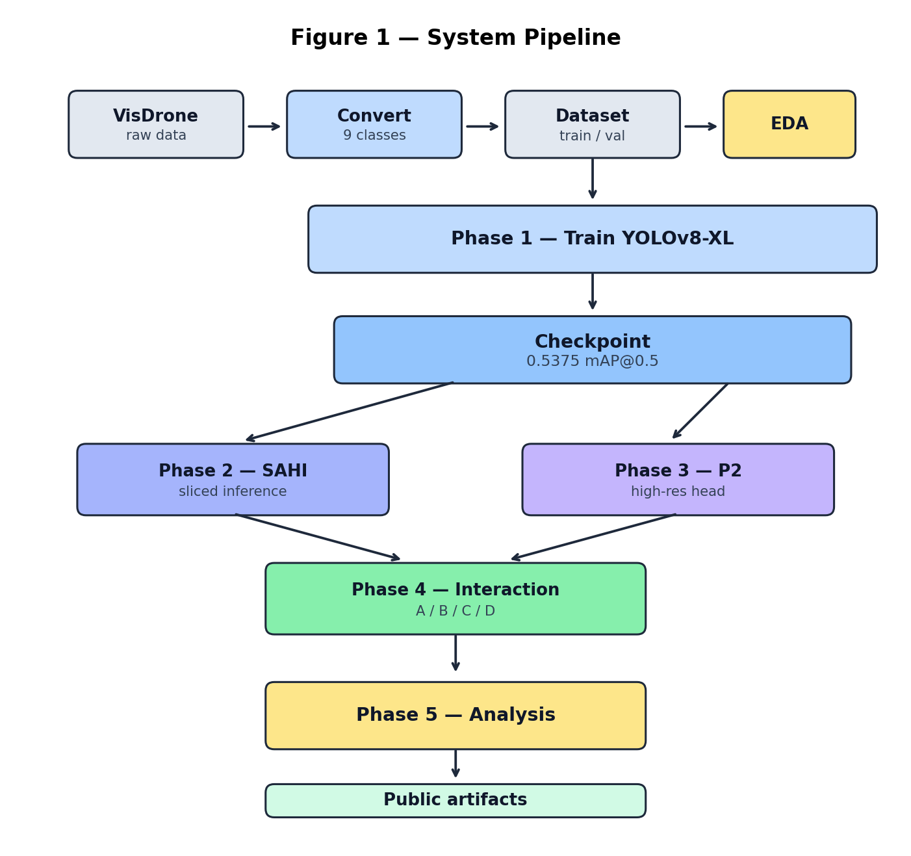
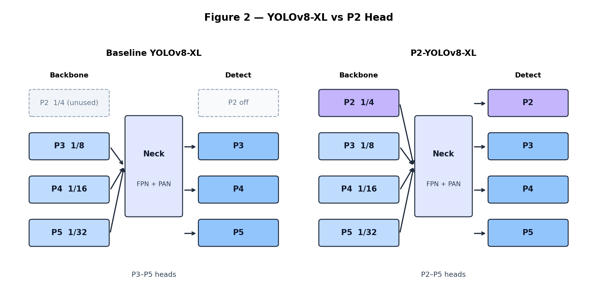
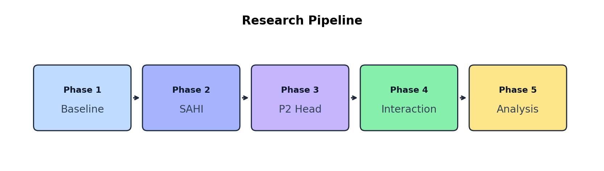
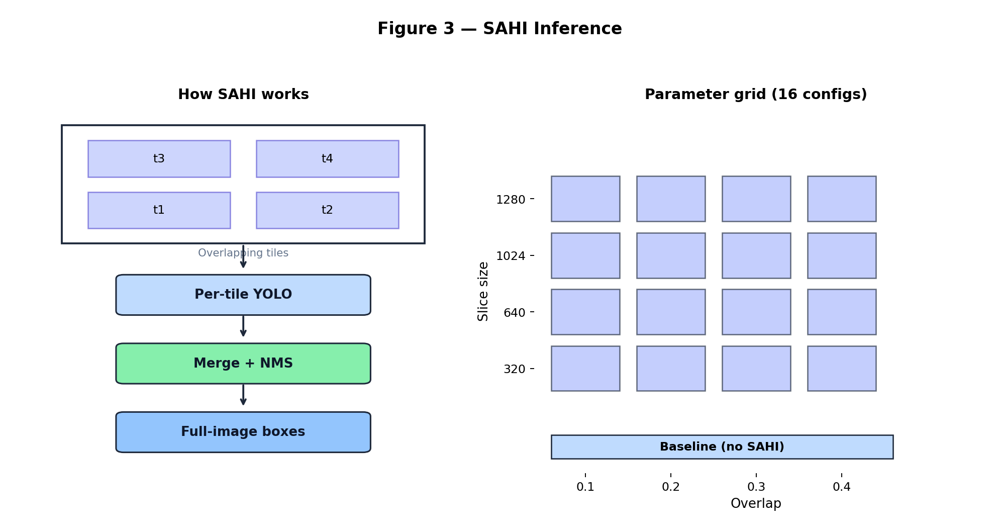
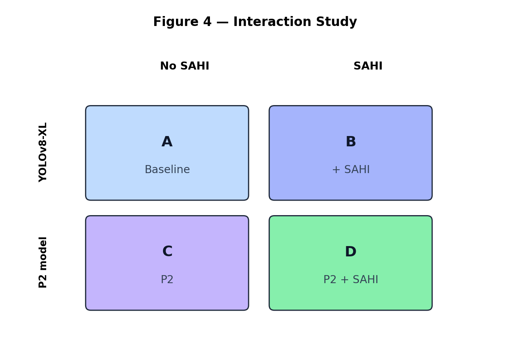
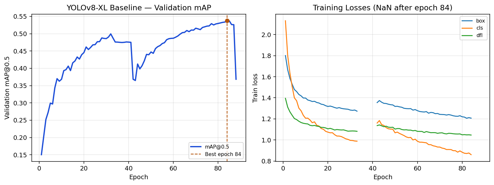

<div align="center">

# Small-Object Detection on Drone Imagery

**YOLOv8-XL Baseline and SAHI / P2 Interaction Protocol for VisDrone-DET**

[](#run-and-evaluate)
[](#method)
[](#architecture)
[](#data)
[](#results)

SAHI · P2 head · Interaction study · RTX 5060 8GB Windows baseline

[Project page](https://codewith-rafi.github.io/small-object-drone-detection-benchmark/) · [Baseline metrics](./01_benchmark/results/baseline_metrics.json) · [Code](https://github.com/codewith-rafi/small-object-drone-detection-benchmark)

</div>

## Overview

This repository asks a narrow, testable question: **on VisDrone-DET with a Windows / 8GB-GPU training recipe, how strong is a YOLOv8-XL baseline for dense small-object aerial detection, and how do SAHI sliced inference and a P2 detection head interact under one evaluation protocol?**

The research pipeline covers five phases: VisDrone baseline training, SAHI parameter study, P2-head training, four-condition interaction analysis, and failure-mode guidelines.

## Research Design

### Scientific Motivation

Aerial detectors fail on VisDrone because most instances are tiny, densely packed, and class-imbalanced. Two complementary remedies are often proposed separately:

1. **SAHI** - inference-time tiling that enlarges effective resolution for small objects ([Akyon et al., ICIP 2022](#references)).
2. **High-resolution / extra detection heads** (P2-style) - architectural capacity for small scales (related: [TPH-YOLOv5, ICCVW 2021](#references)).

This project addresses that split by combining:

- **Controlled single-GPU recipe:** YOLOv8-XL at 1280, batch 1, workers 0 on an RTX 5060 8GB Windows host.
- **Shared baseline checkpoint:** Phase 1 selects one validation-best weights file that later phases reuse.
- **Complementary interventions:** SAHI (inference) versus P2 (architecture) on the same evaluation protocol.
- **Four-condition interaction:** Baseline / +SAHI / +P2 / +both with synergy, redundancy, and interaction-gain definitions.

### Architecture



*Data -> baseline checkpoint -> SAHI and P2 branches -> interaction -> analysis -> public artifacts.*

Baseline detector specs:

- Detector: Ultralytics **YOLOv8-XL** (`yolov8x`)
- Input size: **1280x1280**
- Batch: **1**, workers: **0** (Windows dataloader deadlock avoidance)
- Optimizer: AdamW, cosine LR, AMP
- Augmentations: mosaic, copy-paste, HSV (aerial-safe: no flip-up/down)



*Baseline Detect on P3/P4/P5 versus P2-augmented Detect on P2/P3/P4/P5 (1/4-scale head for small objects).*

### Experimental Protocol



| Phase                     | Focus                                                                         |
| ------------------------- | ----------------------------------------------------------------------------- |
| **Phase 1 - Baseline**    | Fixed VisDrone YOLOv8-XL checkpoint (0.5375 `mAP@0.5`) shared by later stages |
| **Phase 2 - SAHI**        | Sliced inference for small objects; accuracy-speed trade-off                  |
| **Phase 3 - P2 head**     | High-resolution detection head for tiny instances                             |
| **Phase 4 - Interaction** | Compare baseline / SAHI / P2 / both                                           |
| **Phase 5 - Analysis**    | Failure cases and practical guidance                                          |




*Sliced inference with NMS merge, and the 4x4 slice x overlap study grid against a no-SAHI baseline.*



*Four-condition design (A/B/C/D) on the same val set. Synergy S = (D-C)-(B-A); redundancy R = 1 - (D-A)/((B-A)+(C-A)); interaction gain IG = (D-A) - max(B-A, C-A).*

Regenerate figures with:

```bash
python 01_benchmark/scripts/generate_architecture_figures.py
```

### Coverage Matrix


| Research requirement           | Implementation                                               | Evidence                                                                                        |
| ------------------------------ | ------------------------------------------------------------ | ----------------------------------------------------------------------------------------------- |
| VisDrone DET, 9 usable classes | Convert ignore/others out; merge pedestrian/people -> person | `01_benchmark/scripts/visdrone2yolo.py`, `01_benchmark/data/visdrone_simple.yaml`               |
| Dataset characterization       | Size histogram, density, class imbalance                     | `01_benchmark/eda_results/`                                                                     |
| Single-GPU Windows baseline    | YOLOv8-XL, imgsz 1280, batch 1, workers 0                    | `01_benchmark/scripts/train_yolov8_xl.py`                                                       |
| Validation metrics             | Best epoch by `mAP@0.5`                                      | `01_benchmark/results/baseline_metrics.json`                                                    |
| Checkpoint verification        | Size/backup checks                                           | `01_benchmark/scripts/verify_backups.py`                                                        |
| SAHI parameter grid            | 4x4 slice x overlap study                                    | `01_benchmark/scripts/sahi_parameter_study.py`                                                  |
| P2 head config                 | YAML generator for high-res head                             | `01_benchmark/scripts/p2_head_modification.py`                                                  |
| Interaction metrics            | Synergy / redundancy / interaction gain                      | `01_benchmark/scripts/interaction_metrics.py`, `01_benchmark/scripts/interaction_study_plan.md` |
| Data governance                | No images/weights in git                                     | `.gitignore`, [Data Governance](#data-governance)                                               |


## Method

### Data


| Item                     | Value                                                                       |
| ------------------------ | --------------------------------------------------------------------------- |
| Source                   | VisDrone-DET ([Zhu et al., TPAMI 2022](#references))                        |
| Official DET split       | 6,471 train / 548 val / 1,610 test-dev (challenge)                          |
| Classes used             | 9 (person, bicycle, car, van, truck, tricycle, awning-tricycle, bus, motor) |
| EDA subsample            | **1,000** train images analyzed for density/size stats (not the full 6,471) |
| Small objects (EDA)      | **66.2%** of boxes < 32x32 px (COCO small definition)                       |
| Mean density (EDA train) | **67.7** objects / image                                                    |


### Training Recipe


| Item            | Value                        |
| --------------- | ---------------------------- |
| Model           | YOLOv8-XL                    |
| Image size      | 1280                         |
| Batch / workers | 1 / 0                        |
| Epochs          | 150 (patience 50)            |
| Hardware        | NVIDIA RTX 5060 8GB, Windows |
| Best epoch      | **84**                       |


### Evaluation Safeguards

- Model selection uses validation `mAP@0.5` only (best epoch 84).
- Public Phase 1 numbers are taken from the logged CSV/JSON, not from retyped estimates.
- VisDrone images, raw annotation dumps, and `.pt` weights are refused by `.gitignore` and are not redistributed.
- Later-phase scripts (SAHI, P2, interaction) are runnable locally once licensed data and local checkpoints exist.

## Results

### Phase 1 - YOLOv8-XL Baseline

From `01_benchmark/results/yolov8x_baseline_results.csv`:


| Metric            | Value               |
| ----------------- | ------------------- |
| Best epoch        | 84                  |
| `mAP@0.5`         | **0.53746**         |
| `mAP@0.5:0.95`    | **0.34715**         |
| Precision         | 0.61315             |
| Recall            | 0.53139             |
| Wall time to best | ≈47.4 h (170,628 s) |


Reference context often cited for VisDrone YOLOv8-XL setups is ≈0.56 `mAP@0.5`; this run reaches **≈96%** of that headline under the documented 8GB Windows constraints.


### Later Phases

Phases 2-5 reuse the Phase 1 checkpoint and evaluation definitions. Run locally after data and weights are available:

```bash
python 01_benchmark/scripts/sahi_parameter_study.py
python 01_benchmark/scripts/sahi_evaluation_final.py
python 01_benchmark/scripts/p2_head_modification.py
```

Four-condition interaction design: Baseline · Baseline+SAHI · P2 · P2+SAHI - see `01_benchmark/scripts/interaction_study_plan.md`.

### Interpretation

- The baseline is selected on validation `mAP@0.5` (epoch 84).
- Absolute mAP remains challenging because VisDrone is dominated by small, dense instances.
- The ≈0.56 headline is context only; this package reports the measured 0.53746 under the documented constraints.
- Phases 2-5 extend the same checkpoint and protocol through SAHI, P2, interaction metrics, and failure analysis; their numeric tables are produced by running the scripts, not by inventing values here.

## Data Governance

- Obtain VisDrone-DET from the official VisDrone / AISKYEYE distribution channels and comply with its terms.
- Place extracted data under `01_benchmark/data/visdrone_raw/` locally; do not commit images or full annotation dumps.
- Never commit model checkpoints (`.pt`), raw VisDrone archives, or private backup copies of weights.
- The repository intentionally ships only aggregate metrics, figures, configs, and code.

## Run and Evaluate

### Prerequisites

- Python 3.10+ (Conda recommended)
- CUDA GPU strongly recommended for training
- VisDrone-DET download (not included)

### Environment

```bash
git clone https://github.com/codewith-rafi/small-object-drone-detection-benchmark.git
cd small-object-drone-detection-benchmark

conda env create -f environment.yml
conda activate drone_detection
# or: pip install -r requirements.txt
```

### Data Build

```bash
# Extract VisDrone into 01_benchmark/data/visdrone_raw/
python 01_benchmark/scripts/visdrone2yolo.py --create-yaml
python 01_benchmark/scripts/test_installations.py
python 01_benchmark/scripts/eda_visdrone.py
```

### Training and Validation

```bash
# Windows launcher (optional)
01_benchmark\start_training.bat

# Or direct (Windows-safe Phase 1 recipe)
python 01_benchmark/scripts/train_yolov8_xl.py

# Validate a local best.pt
python 01_benchmark/scripts/validate_best_model.py
python 01_benchmark/scripts/verify_backups.py
```

Paths resolve from the repository root via `Path(__file__)`; dataset YAML under `01_benchmark/data/` uses relative `path: .`.

## Repository Map


| Path                                   | Contents                                           |
| -------------------------------------- | -------------------------------------------------- |
| `01_benchmark/scripts/`                | EDA, convert, train, validate, SAHI/P2/interaction |
| `01_benchmark/data/`                   | Dataset YAML only (images gitignored)              |
| `01_benchmark/eda_results/`            | EDA report, CSV, statistics figure                 |
| `01_benchmark/results/`                | Baseline metrics, curves, architecture figures     |
| `report/`                              | GitHub Pages project page                          |
| `environment.yml` / `requirements.txt` | Environment pins                                   |


## Contact

**Rafi Ahmed**  
[codewithrafi@outlook.com](mailto:codewithrafi@outlook.com) · [GitHub](https://github.com/codewith-rafi) · [www.codewithrafi.com](https://www.codewithrafi.com)

## Citation

```bibtex
@software{ahmed2026small_object_drone,
  title  = {Small-Object Detection on Drone Imagery: VisDrone YOLOv8-XL Baseline and SAHI/P2 Protocol},
  author = {Ahmed, Rafi},
  year   = {2026},
  url    = {https://github.com/codewith-rafi/small-object-drone-detection-benchmark}
}
```

## References

1. P. Zhu et al., "Detection and Tracking Meet Drones Challenge," *IEEE Transactions on Pattern Analysis and Machine Intelligence*, vol. 44, no. 11, pp. 7380-7399, 2022. (VisDrone)
2. D. Du et al., "VisDrone-DET2019: The Vision Meets Drone Object Detection in Image Challenge Results," in *Proc. IEEE/CVF ICCV Workshops*, 2019.
3. F. C. Akyon, S. O. Altinuc, and A. Temizel, "Slicing Aided Hyper Inference and Fine-tuning for Small Object Detection," in *Proc. IEEE ICIP*, 2022, pp. 966-970, doi:10.1109/ICIP46576.2022.9897990. (SAHI; also arXiv:2202.06934)
4. X. Zhu, S. Lyu, X. Wang, and Q. Zhao, "TPH-YOLOv5: Improved YOLOv5 Based on Transformer Prediction Head for Object Detection on Drone-Captured Scenarios," in *Proc. IEEE/CVF ICCV Workshops*, 2021, pp. 2778-2788.
5. T.-Y. Lin et al., "Microsoft COCO: Common Objects in Context," in *Proc. ECCV*, 2014. (Evaluation protocol / small-object definition)
6. G. Jocher, A. Chaurasia, and J. Qiu, *Ultralytics YOLO* (software). [https://github.com/ultralytics/ultralytics](https://github.com/ultralytics/ultralytics)

## Acknowledgments

- VisDrone / AISKYEYE dataset authors
- Ultralytics YOLO maintainers
- SAHI authors (OBSS)

## License

Code in this repository is released under the [MIT License](LICENSE).